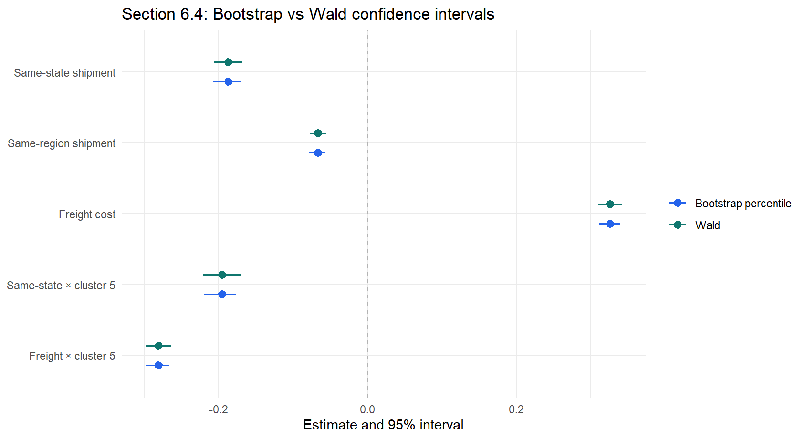
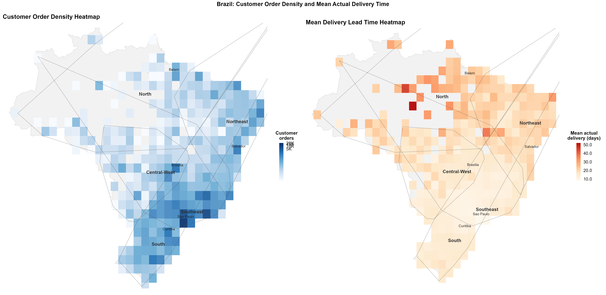
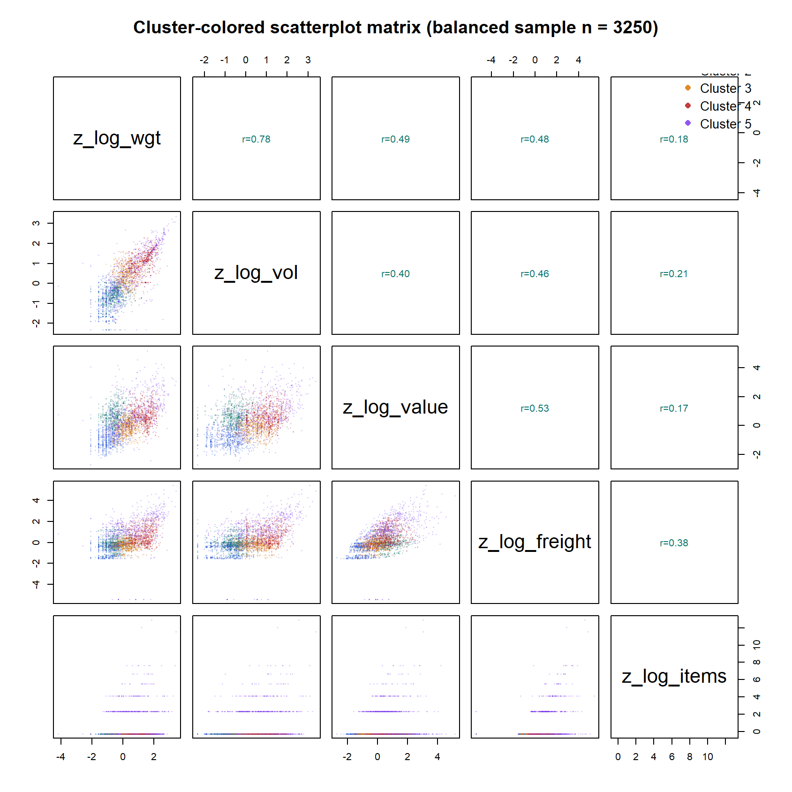
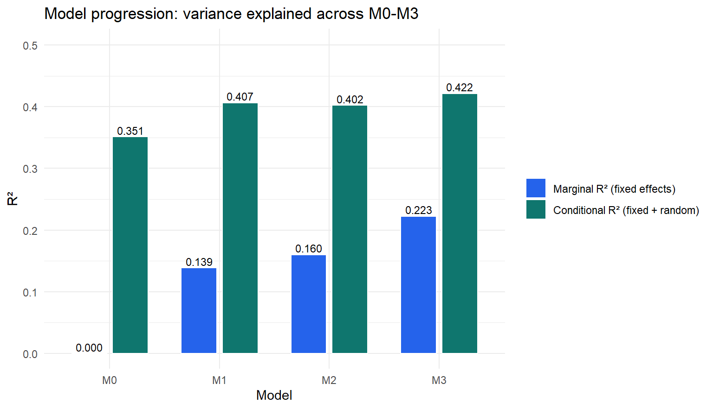

# Delivery Lead Time in E-Commerce – What makes a marketplace order slow?

93,853 Olist orders, a multilevel model with seller and destination-state random intercepts, and a full robustness battery. Routing dominates, shipment profile refines, and a quarter of the variance still sits with *who* ships and *where* — after every control.



[Report (PDF)](report.pdf) · [Notebook (Rmd)](notebook/delivery-lead-time-multilevel.Rmd) · [Rendered HTML](notebook/delivery-lead-time-multilevel.html) · [Slides](docs/presentation.pdf)

## Context

Delivery performance is the service-quality dimension a marketplace controls least directly: it depends on thousands of independent sellers, the geography between seller and buyer, and what is in the box. Three questions:

- **RQ1** How much of the variability in delivery lead time sits at the seller and destination-state level?
- **RQ2** Which order and shipment characteristics are associated with faster or slower delivery?
- **RQ3** Do those estimates survive outliers, trimming, regional re-fits and bootstrap resampling?

## Data

Olist Brazilian e-commerce (Kaggle): six tables (orders, items, products, customers, sellers, geolocation) + a product-category theme mapping, 2016-09 → 2018-10. Cleaned to **93,853 delivered single-seller orders**; outcome is log delivery lead time (purchase → customer delivery). Raw CSVs are not committed — see `data/README.md`.



## Results

- **Routing is the largest lever.** Same-state shipments have ~17% shorter lead times (log-scale coefficient −0.19, bootstrap CI clear of zero); same-region ~7%. Freight intensity is the strongest positive driver (+0.33).
- **Seller and destination still matter after controls.** In M3, seller random-intercept variance 0.037, customer-state 0.032, residual 0.197 → **25.9% of variance sits above the order level**, which is what justifies the multilevel specification.
- **Effects are regime-dependent.** Adding shipment-profile clusters (robust PCA + clustering on weight, volume, value, freight) and their interactions improves fit sharply (χ² = 1,348 on 8 df; AIC 117,189 → 115,806; marginal R² 0.222 → 0.247). Same-state coefficients range −0.36 to −0.19 across clusters; freight coefficients 0.03 to 0.40. A pooled coefficient is a useful average that hides real operational heterogeneity.
- **Robust to everything tried.** MCD flags 9.6% shipment-profile outliers, yet robust fits keep OLS directions (max drift 0.032); trimmed / no-theme / seller-only mixed models keep core signs (max drift 0.091); region-specific models preserve direction for 100% of tracked terms; bootstrap and Wald intervals overlap for 100% of terms.

**Managerial reading:** maximise same-state fulfilment through inventory positioning and seller matching; make ETA / SLA rules regime-aware rather than global; keep explicit seller-performance monitoring because seller dispersion persists after adjustment.

## Approach

1. EDA on raw delivery patterns, lead-time distribution and transformation choice.
2. Order-level dataset with routing (same state / region), shipment dimensions, value, freight, payment, season and product theme.
3. Shipment-regime engineering: robust multivariate diagnostics (MCD), PCA, clustering → five-cluster profile.
4. Model ladder M0 (null) → M3 (full fixed effects + seller and state random intercepts) → M4 (cluster main effects and interactions); likelihood-ratio tests, AIC/BIC, marginal/conditional R².
5. Robustness: `robustlmm` fits, 95% trimming, variant specifications, region-specific models, parametric bootstrap CIs (80 draws) vs Wald.

| Cluster profile | Model comparison |
|---|---|
|  |  |

## Stack

R · lme4 / lmerTest · robustlmm · robustbase · performance · boot · tidyverse

## Run it

```r
# place Olist CSVs in data/ (see data/README.md), then
rmarkdown::render("notebook/delivery-lead-time-multilevel.Rmd")
```

## Structure

```
olist-delivery-lead-time-multilevel/
├── report.pdf
├── notebook/          # Rmd + rendered HTML
├── output/tables/     # city-level order & delivery metrics
├── data/              # category mapping + IBGE population; raw Olist documented in data/README.md
├── docs/              # presentation, proposal, methodology workflow
└── assets/
```

Course project for *Advanced Multivariate Statistics*. The delivery model was later extended with weather terms in my thesis: [weather-shocks-ecommerce-thesis](https://github.com/alyssahoang/weather-shocks-ecommerce-thesis).
